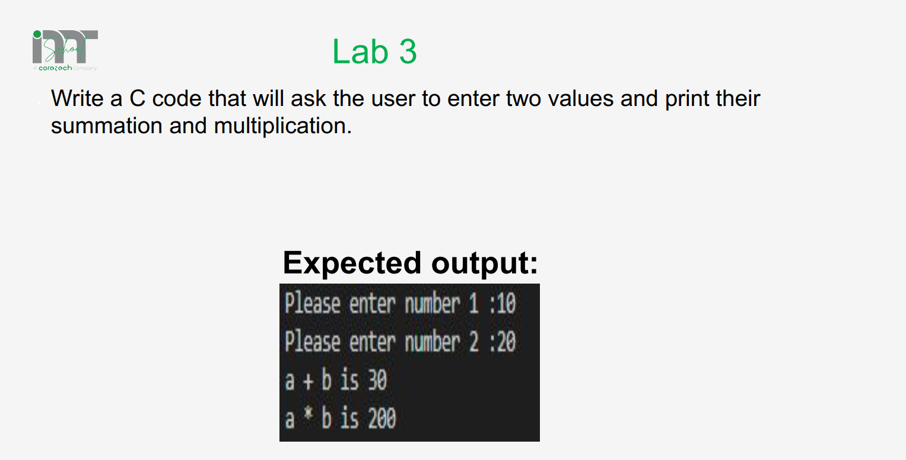
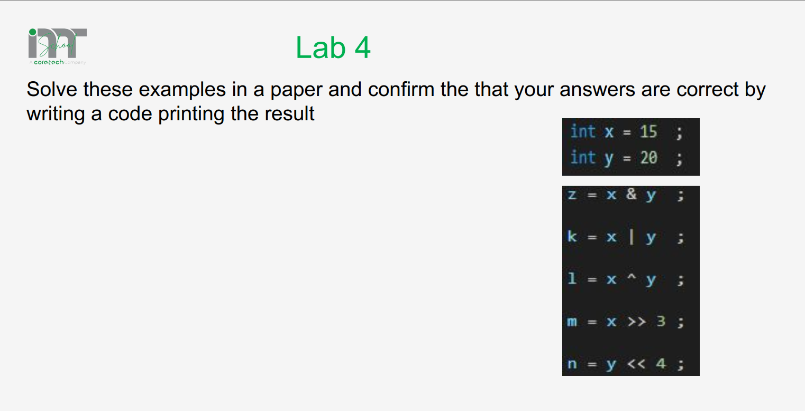
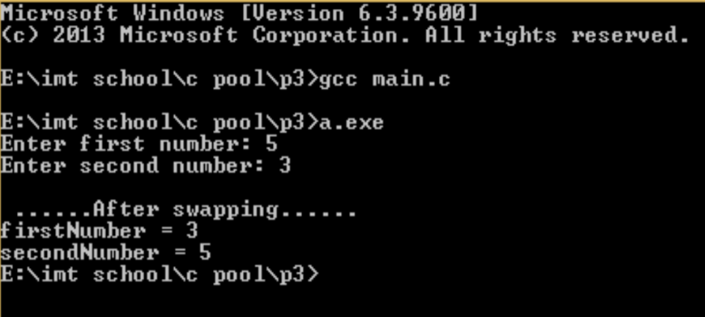
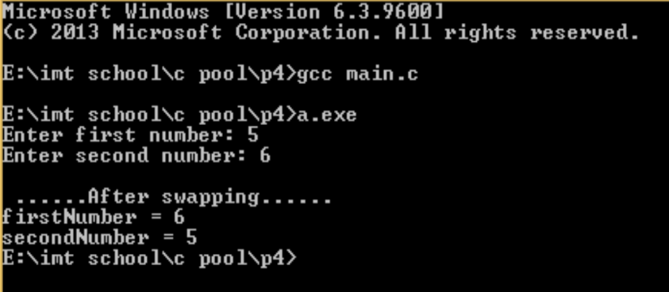
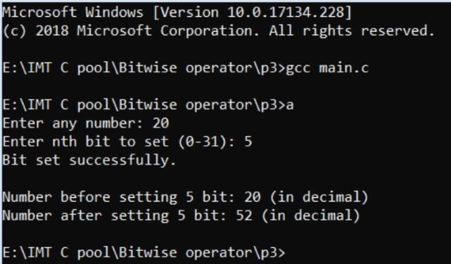
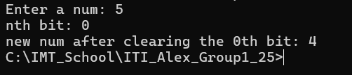
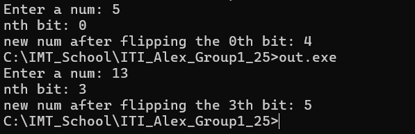

# Session: Variables and Operators
## Lecture Lab 1
### Problem


### Solution
```c
#include <stdio.h>

int main (void)
{
	int num1, num2;
    printf("Enter first num: ");
    scanf("%d", &num1);
    printf("Enter second num: ");	
    scanf("%d", &num2);
	printf("%d + %d = %d\n", num1, num2, num1+num2);
	printf("%d * %d = %d\n", num1, num2, num1*num2);
	
	return 0;
}
```

## Lecture Lab 2
### Problem


### Solution
```c
#include <stdio.h>

int main (void)
{
	int x = 15;
	int y = 20;
	printf("%d & %d = %d\n", x, y, x&y );
	printf("%d | %d = %d\n", x, y, x|y );
	printf("%d ^ %d = %d\n", x, y, x^y );
	printf("%d >> 3 = %d\n", x, x>>3 );
	printf("%d << 4 = %d\n", y, y<<4 );
    
    return 0;
}
```

## Lab 1:
### Problem
Write a c code that will ask the user to enter two values and swap then print it.
 

### Solution
```c
#include <stdio.h>

int main (void)
{
	int num1, num2, temp;
	printf("Enter first num: ");
	scanf("%d",&num1);
	printf("Enter second num: ");
	scanf("%d",&num2);
	
	temp= num1;
	num1 = num2;
	num2 = temp;
	printf("----- After Swapping ----\n");
	printf("First num = %d\n",num1);
	printf("Second num = %d\n",num2);
	
	return 0;
}
```

## Lab 2:
### Problem
Write a c code that will ask the user to enter two values and swap `(without using third variable )` then print it

 

### Solution
```c
#include <stdio.h>

int main (void)
{
	int num1, num2;
	printf("Enter first num: ");
	scanf("%d",&num1);
	printf("Enter second num: ");
	scanf("%d",&num2);
	
	num1 ^= num2;
	num2 ^= num1;
	num1 ^= num2;
	printf("----- After Swapping ----\n");
	printf("First num = %d\n",num1);
	printf("Second num = %d\n",num2);
	
	return 0;
}
```
### Another Solution
```c
#include <stdio.h>

int main (void)
{
	int num1, num2;
	printf("Enter first num: ");
	scanf("%d",&num1);
	printf("Enter second num: ");
	scanf("%d",&num2);
	
	num1 += num2;
	num2 = num1 - num2;
	num1 -= num2;
	printf("----- After Swapping ----\n");
	printf("First num = %d\n",num1);
	printf("Second num = %d\n",num2);
	
	return 0;
}
```


## Lab 3:
### Problem
Write a c program to input any number from user and set nth bit of the given number using bitwise operator.


 

### Solution
```c
#include <stdio.h>

int main (void)
{
	int num, nbit;
	printf("Enter a num: ");
	scanf("%d",&num);
	printf("nth bit: ");
	scanf("%d",&nbit);
	
	num = num |(1<<nbit);
	printf("new num: %d", num);
	
	return 0;
}
```

## Lab 4:
### Problem
Write a c program to input any number from user and clear nth bit of the given number using bitwise operator.

 

### Solution
```c
#include <stdio.h>

int main (void)
{
	int num, nbit;
	printf("Enter a num: ");
	scanf("%d",&num);
	printf("nth bit: ");
	scanf("%d",&nbit);
	
	num = num & (~(1<<nbit));
	printf("new num after clearing the %dth bit: %d", nbit, num);
	
	return 0;
}
```
## Lab 5:
### Problem
Write a c program to input any number from user and flip nth bit of the given number using bitwise operator.

 

### Solution
```c
#include <stdio.h>

int main (void)
{
	int num, nbit;
	printf("Enter a num: ");
	scanf("%d",&num);
	printf("nth bit: ");
	scanf("%d",&nbit);
	
	num = num ^ ((1<<nbit));
	printf("new num after flipping the %dth bit: %d", nbit, num);
	
	return 0;
}

```
