# Session : Loops
## Lecture Lab 1
### Problem
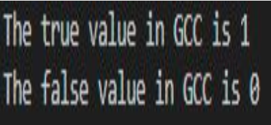

### Solution
```c
#include <stdio.h>

int main()
{
	printf("The true value in gcc is %d\n", 2>1);
	printf("The false value in gcc is %d\n", 3<1);

	return 0;
}
```

## Lecture Lab 2
### Problem
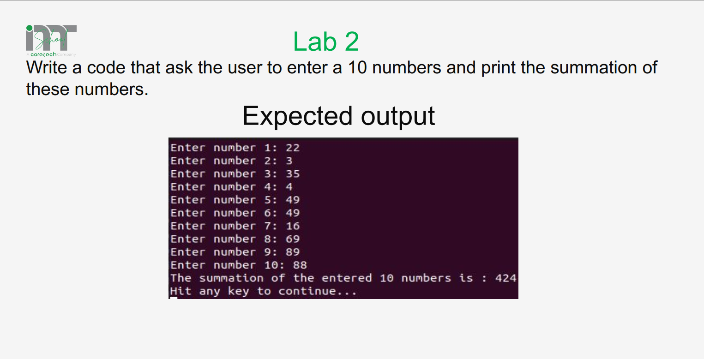

### Solution
```c 
#include <stdio.h>
int main(void)
{
    int x = 0,sum = 0;
    for (int i = 0; i < 10; i++)
    {
        printf("Enter num %d:", i + 1);
        scanf("%d", &x);
        sum += x;
    }
    printf("Sum = %d\n", sum);
    printf("Avg = %0.2f", (sum / 5.0));

    return 0;
}
```

## Lecture Lab 3
### Problem
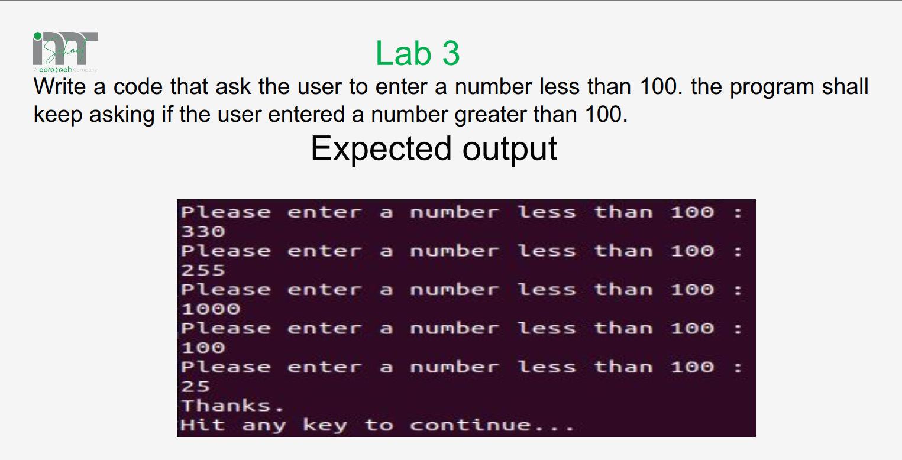

### Solution
```c 
#include <stdio.h>

int main(void)
{
    int num = 101;
    while (num >= 100)
    {
        printf("please a num less than 100: ");
        scanf("%d", &num);
        if (num < 100)
            printf("thank u\n");
    }
    return 0;
}

``` 

## Lab 1
### Problem
Write a c program to input two numbers and find maximum between two numbers using conditional/ternary operators

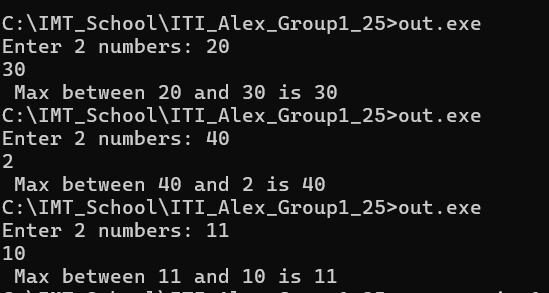

### Solution using Conditional operators
```c
#include <stdio.h>

int main()
{
	int num1, num2, max;
	printf("Enter 2 numbers: ");
	scanf("%d %d", &num1, &num2);
	if(num1>num2)
		max = num1;
	else 
		max = num2;
	printf("Max between %d and %d is %d",num1, num2, max);	
	
	return 0;
}
```
### Solution using Ternary operators
```c
#include <stdio.h>

int main()
{
	int num1, num2, max;
	printf("Enter 2 numbers: ");
	scanf("%d %d", &num1, &num2);
	
	max = (num1>num2)? num1:num2;
	printf("Max between %d and %d is %d",num1, num2, max);	
	
	return 0;
}
```

## Lab 2
### Problem
Write a c program to input three numbers and find maximum between them using conditional/ternary operators

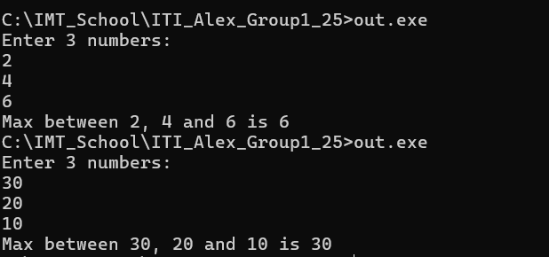

### Solution using Conditional operators
```c
#include <stdio.h>

int main()
{
	int num1, num2, num3, max;
	printf("Enter 3 numbers: \n");
	scanf("%d %d %d", &num1, &num2, &num3);
	if(num1>num2 && num1>num3)
		max = num1;
	else if(num2 > num3)
		max = num2;
	else
		max = num3;
	printf("Max between %d, %d and %d is %d",num1, num2, num3, max);	
	
	return 0;
}
```

### Solution using Ternary operators
```c
#include <stdio.h>

int main()
{
	int num1, num2, num3, max;
	printf("Enter 3 numbers: \n");
	scanf("%d %d %d", &num1, &num2, &num3);
	
	max = (num1>num2 && num1>num3)? num1:(num2>num3)?num2: num3;
	printf("Max between %d, %d and %d is %d",num1, num2, num3, max);	
	
	return 0;
}
```
# Lab 3
### Problem
Implement calculator in c that supports the following operations (+, -, *, /) and prints warnning msg if operation isn't supported

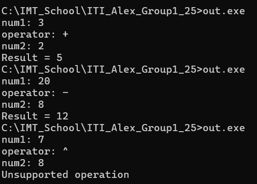

### Solution
```c
#include <stdio.h>

int main()
{
	char op;
	int num1, num2;
	printf("num1: ");
	scanf("%d", &num1);
	
	printf("operator: ");
	scanf(" %c",&op);
	
	printf("num2: ");
	scanf("%d", &num2);

	switch(op)
	{
		case '+':
		printf("Result = %d", num1+num2);
		break;
		case '-':
		printf("Result = %d", num1-num2);
		break;
		case '*':
		printf("Result = %d", num1*num2);
		break;
		case '/':
		printf("Result = %d", num1/num2);
		break;
		default:
		printf("Unsupported operation\n");
		break;
		
	}
	return 0;
}
```
## Lab 4
### Problem
Write a C program to find the sum of 10 numbers

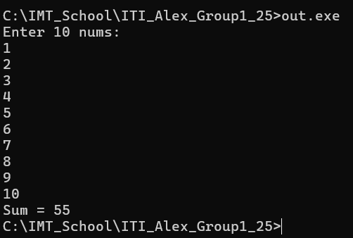

### Solution
```c
#include <stdio.h>

int main()
{
	int x = 0, sum;
	printf("Enter 10 nums:\n");
	for(int i=0; i<10; i++)
	{
		scanf("%d",&x);
		sum+=x;
	}
	printf("Sum = %d", sum);
	return 0;
}
```

## Lab 5
### Problem
Write a C program that finds the factorial of a number

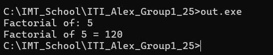

### Solution
```c
#include <stdio.h>

int main()
{
	int n, fac =1;
	printf("Factorial of: ");
	scanf("%d",&n);
	int save_n = n;
	while(n>0)
	{
		fac *=n;
		n--;
	}
	printf("Factorial of %d = %d", save_n, fac);
	return 0;
}
```

## Lab 6
###  Problem
Write a C code that will ask the user to enter a number and checks whether it's even or odd, and repeat this until the user presses any key except 'y', using `do-while`

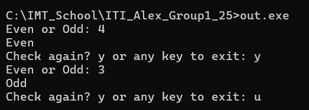

### Solution
```c
#include <stdio.h>

int main()
{
	int num;
	char flag = 'y';
	do{
		printf("Even or Odd: ");
		scanf("%d",&num);

		if(num%2 == 0)
			printf("Even\n");
		else
			printf("Odd\n");
		printf("Check again? y or any key to exit: ");
		scanf(" %c",&flag);
	}while(flag == 'y');
	
	return 0;
}
```
## Lab 7
### Problem

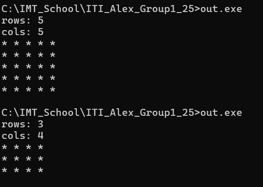

### Solution
```c
#include <stdio.h>

int main()
{
	int rows = 0;
	int cols = 0;
	printf("rows: ");
	scanf("%d",& rows);
	printf("cols: ");
	scanf("%d",& cols);
	for(int i =0; i<rows; i++)
	{
		for(int i = 0; i<cols; i++)
			printf("* ");
		printf("\n");
	}
	return 0;
}
```
## Lab 8
### Problem

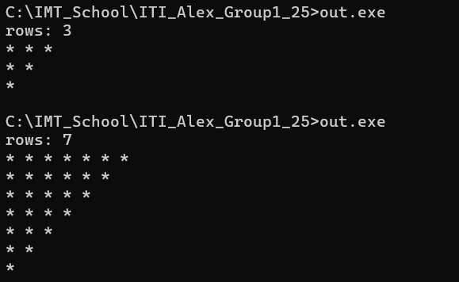

### Solution
```c
#include <stdio.h>

int main()
{
	int rows = 0;
	printf("rows: ");
	scanf("%d",& rows);

	for(int i = rows; i>0; i--)
	{
		for(int j = i; j>0; j--)
			printf("* ");
		printf("\n");
	}
	return 0;
}
```

## Lab 9
### Problem
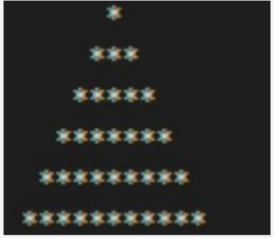

### Solution
```c
#include <stdio.h>

int main(void)
{
/*

  *
 ***
*****

*/
    int rows;
    printf("Enter #rows: ");
    scanf("%d", &rows);
    int stars = 1;
    for (int i = rows + 1; i > 1; i--)
    {
        for (int j = i; j > 2; j--)
        {
            printf(" ");
        }
        for (int k = 0; k < stars; k++)
        {
            printf("*");
        }
        printf("\n");
        stars += 2;
    }
    return 0;
}
```
