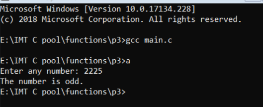
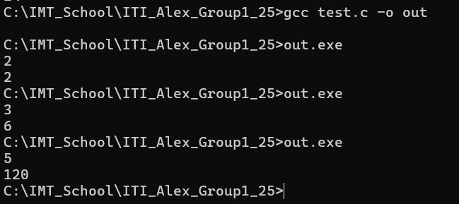
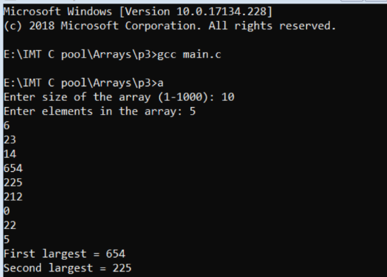
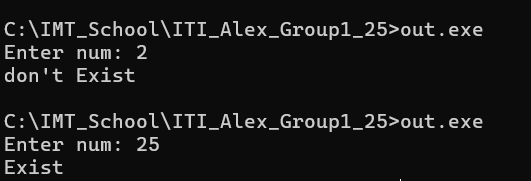

# Session: Functions and Arrays 

## Lab 1
### Problem
Write a c program to input a number from user and check whether given number is even or odd using functions.



### Solution
```c
#include <stdio.h>

// Function prototype
void parity_checker(int num);

int main (void)
{
	int num;
	printf("Enter num: ");
	scanf("%d", &num);
	// Function call
	parity_checker(num);             
	return 0;
}

// Function definition (implementation)
void parity_checker(int num)
{
	(num%2 == 0)? printf("even\n"): printf("odd\n") ;
}

```

## Lab 2
### Problem
Write a c program to find factorial using function



### Solution
```c

#include <stdio.h>

int fact(int num);

int main (void)
{
	int num;
	scanf("%d", &num);
	printf("%d",fact(num));
	return 0;
}

int fact(int num)
{
	if(num == 1 || num == 0)
		return 1;
	return num*fact(num-1);
}

```


## Lab 3
### Problem
Write a c program to find the largest and the second largest element in an array using 2 methods and use functions



### Solution : Linear Searching
```c
#include <stdio.h>
#include <limits.h>


void find_first_and_second_Max(int size, int arr[]);

int main (void)
{
	int arr[1000];
	int size;
	
	printf("Enter size of the array (1-1000): ");
	scanf("%d", &size);
	
	printf("Enter elments: ");
	for(int i=0; i<size; i++)
	{
		scanf("%d", &arr[i]);
	}
	
	find_first_and_second_Max(size, arr);
	
	
	return 0;
}
void find_first_and_second_Max(int size, int arr[])
{
	int max1, max2;
	max1 = max2 = INT_MIN;
	for(int i=0; i<size; i++)
	{

		if(arr[i]>max1)
		{ 
			/*
             * If current element of the array is first largest
             * then make current max as second max
             * and then max as current array element
			*/
			max2 = max1;
			max1 = arr[i];
		}else if(arr[i]>max2 && arr[i]<max1)
		{
			max2 = arr[i];
		}
	}

	printf("First max: %d\n",max1);
	printf("Second max: %d\n",max2);
}

```
### Another Solution : Sort (using bubble sort) the array, then print the last and second-to-last elements.
```c
#include <stdio.h>

void sort(int size, int arr[]);

int main (void)
{
	int arr[1000];
	int size;
	
	printf("Enter size of the array (1-1000): ");
	scanf("%d", &size);
	
	printf("Enter elments: ");
	for(int i=0; i<size; i++)
	{
		scanf("%d", &arr[i]);
	}
	sort(size, arr);
	
	printf("First max: %d\n",arr[size-1]);
	printf("Second max: %d\n",arr[size-2]);
	return 0;
}

void sort(int size, int arr[])
{
	int temp;
	for(int j =0; j<size;j++)
	{
		for(int i=0; i<size-j-1 ; i++)
		{
			if(arr[i] > arr[i+1])
			{
				// swap
				temp = arr[i];
				arr[i] = arr[i+1];
				arr[i+1] = temp;
			}
		}
	}
}

```

## Lab 4
### Problem
You are given an unorderd array, search about a number requested by user.



### Solution
```c
#include <stdio.h>


int main (void)
{
	int num;
	int arr[] = {10,25,4,3,16,5,7};
	printf("Enter num: ");
	scanf("%d", &num);
	int size = sizeof(arr)/sizeof(arr[0]);
	
	// sort using bubble sort
	int temp;
	for(int j =0; j<size;j++)
	{
		for(int i=0; i<size-j-1 ; i++)
		{
			if(arr[i] > arr[i+1])
			{
				// swap
				temp = arr[i];
				arr[i] = arr[i+1];
				arr[i+1] = temp;
			}
		}
	}
	
	// Searching using binary search
	int start = 0, mid = 0;
	int end = size-1;
	int flag = 0;
	while(start <= end)
	{
		mid = (int)((start + end )/ 2);
		
		if(arr[mid] == num)
		{
			flag = 1;
			break;
		}else if(num > arr[mid])
		{
			 start = mid+1;
		}
		else if(num < arr[mid])
		{
			end = mid-1;
		}
			
	}
	if(flag == 1)printf("Exist");
	else printf("don't Exist\n");
	
	
	return 0;
}

```
