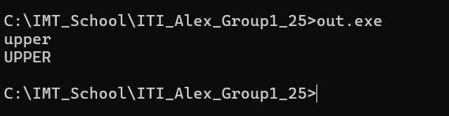
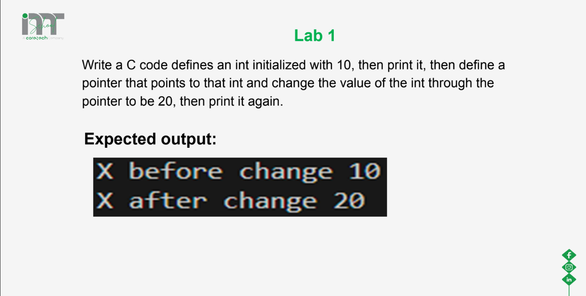
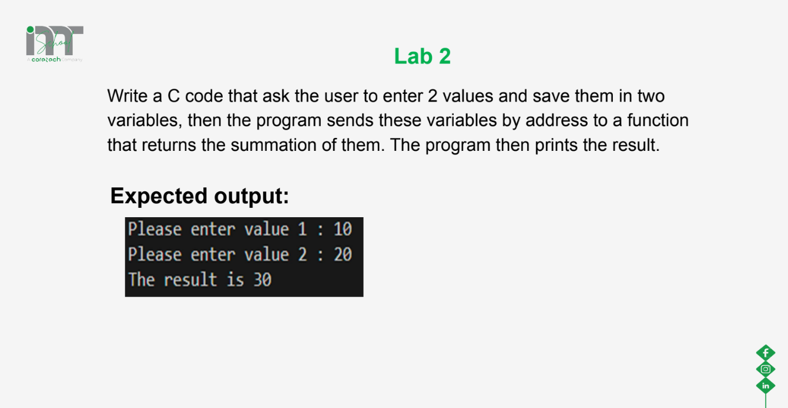
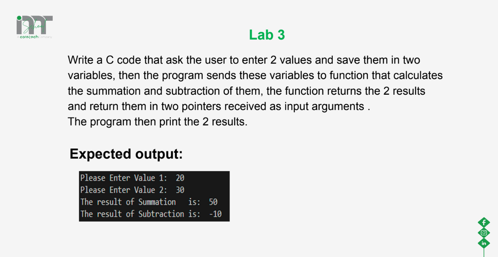
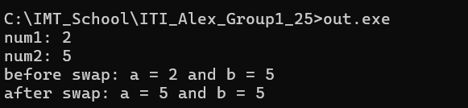
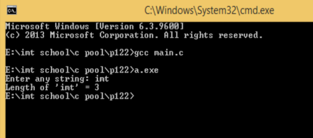
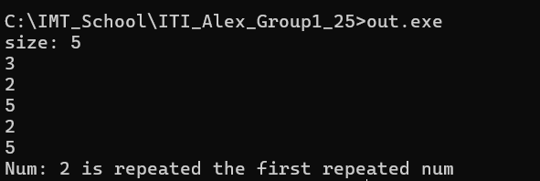

# Session: Pointers
## Lecture Lab 1:



### Solution
```c
#include <stdio.h>

int main()
{
    char buffer[100];
    int size = 10;
    fgets(buffer, size, stdin);
    
    for (int i = 0; buffer[i] != '\0'; i++)
    {
        buffer[i] = (buffer[i] == ' ') ? ' ' :
                    (buffer[i] >= 'a' && buffer[i] <= 'z') ? buffer[i] + ('A' - 'a') :
                    buffer[i];
    }

    printf("%s", buffer);
    return 0;
}

```
## Lecture Lab 2:
### Problem


### Solution
```c
#include <stdio.h>

int main (void)
{
	int x =5;
	int* ptr;
	ptr = &x;
	/* dereferance (This line means go to ptr, find out what is inside 
	 it and consider it address and jump to it, then assign 20) */
	*ptr = 20;
	printf("%d",x);
	return 0;
}

```

## Lecture Lab 3:
### Problem


### Solution
```c
#include <stdio.h>

void add(int a, int b, int* sum);

int main (void)
{
	int n1,n2;
	int sum=0;
	printf("first num: ");
	scanf("%d",&n1);
	printf("second num: ");
	scanf("%d",&n2);
	add(n1, n2, &sum);
	printf("Sum = %d",sum);
	
}

void add(int a, int b, int* sum)
{
	*sum = a+b;
}
```

## Lecture Lab 4:
### Problem


### Solution
```c
#include <stdio.h>

void Calc(int n1, int n2, int* sum,int *sub);

int main()
{
	int x,y,summation,subtraction;
	printf("Enter two values:\n");
	scanf("%d%d",&x,&y);
	Calc(x, y, &summation, &subtraction);
	printf("The sum is %d\n",summation);
	printf("The sub is %d\n",subtraction);
	
	
	return 0;
}

void Calc(int n1, int n2, int* sum,int *sub)
{
	*sum = n1 + n2;
	*sub = n1 - n2;
}
```
## Lab 1
### Problem
Write a c program to swap 2 numbers using pointers



### Solution
```c
#include <stdio.h>

void swap(int* n1, int* n2);

int main()
{
	int a,b;
	printf("num1: ");
	scanf("%d",&a);
	printf("num2: ");
	scanf("%d",&b);
	printf("before swap: a = %d and b = %d\n", a, b);
	swap(&a, &b);
	printf("after swap: a = %d and b = %d\n", a, b);
	
    return 0;
}

void swap(int* n1, int* n2)
{
	int temp ;
	temp = *n1;
	*n1  = *n2;
	*n2  = *n1;
}
```
## Lab 2
### Problem
Write a C Program to find length of string using pointer



### Solution
```c
#include <stdio.h>

int main()
{
	char text[100];
	char* ptr_str = text;
	int count =0;
	
	printf("Enter any string: ");
    scanf("%s",text);
	
	while((*ptr_str)!='\0')
	{
		count++;
		ptr_str++;
	}
	
	printf("Length of '%s' = %d", text, count);	
	
	return 0;
}

```


## Lab 3
### Problem
Write a c program to print the first repeated number.



### Solution
```c
#include <stdio.h>

void find_repeated_num(int* ptr_arr, int size, int* num);

int main()
{
	int arr[1000];
	int size;
	int count=0, num=0;
	printf("size: ");
	scanf("%d", &size);
	
	// scan
	for (int i = 0; i < size; i++) {
		scanf("%d", &arr[i]);
	}
	find_repeated_num(arr, size, &num );

	printf("Num: %d is repeated the first repeated num", num);


	return 0;
}

void find_repeated_num(int* ptr_arr, int size, int* num)
{

	for(int j = 0; j<size ;j++)
	{
		for(int i = j+1; i<size ;i++)
		{
			if(ptr_arr[j] == ptr_arr[i])
			{
				 (*num) = ptr_arr[i];
				 return;
			}
			
		}

	}

}

```
