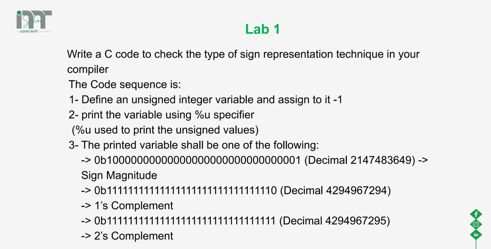
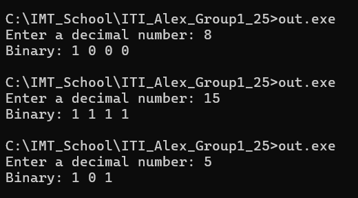

# Session: Data Modifiers
## Lecture Lab 1
### Problem



### Solution
```c
#include <stdio.h>

int main()
{
	unsigned int x=-1;
	printf("%u\n",x);
	
	return 0;
}

```

## Lab 1
### Problem
Write a c program to convert from decimal to binary using (functions, arrays, and pointers) 



### Solution
```c

#include <stdio.h>

void decimal_to_binary(int arr[], long long int num, int* size);

int main(){
	
	long long int num;
	int	size;
	int binary_arr[50];
	
	printf("Enter a decimal number: ");
	scanf("%lld",&num);
	
	decimal_to_binary(binary_arr, num, &size);
	
	// Print binary array in reversed order
	printf("Binary: ");
	for(int i=size-1; i>=0; i--)
	{
		printf("%d ", binary_arr[i]);
	}
	printf("\n");

    return 0;
}

void decimal_to_binary(int arr[], long long int num, int* size)
{
	*size = 0;
	while(num>0)
	{
		// record the remainder
		arr[*size] = num%2;
		
		// divide by 2
		num /= 2;
		(*size)++;
		
	}
}
```
## Lab 2 : static keyword
### Problem
```c
#include <stdio.h>

int increment(void);

int main(){
	
	increment();
	increment();
	increment();
	
    return 0;
}

int increment(void)
{
	int counter =0;
	counter++;
	printf("%d\n", counter);
}

```

### Solution : Fixed version (use static keyword)
```c
#include <stdio.h>

int increment(void);

int main(){
	
	increment();
	increment();
	increment();
	
    return 0;
}

int increment(void)
{
	static int counter =0;
	counter++;
	printf("%d\n", counter);
}

```


## Lab 3
### Problem
```
Write a C program to demonstrates how to use the `extern` keyword to share a global variable (sharedValue) between two source files `file1.c`, which contains the main function and modifies the variable, and `file2.c`, which defines the variable and contains a function (display) that accesses and prints its value.
```

### Solution 
In `file1`

```c
/*  
	This is a source file, there is no main function here
	only one file must contain the main() function. 
	That's the entry point for the entire program.
*/
#include <stdio.h>

int sharedValue = 10;

void display(void)
{
	printf("In src file1.c sharedValue = %d\n",sharedValue);
} 

```
In `file2`

```c
#include <stdio.h>

// Declare the variable that is defined in another file
extern int sharedValue;

void display(void);

int main()
{
	sharedValue = 50;
	// calling this function
	printf("In file2 sharedValue = %d\n", sharedValue);
	display();
	return 0;
}
```
### How to Compile:
`gcc file1.c file2.c -o out`
`out.exe`
