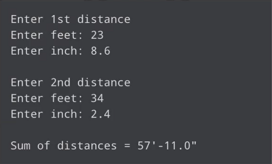
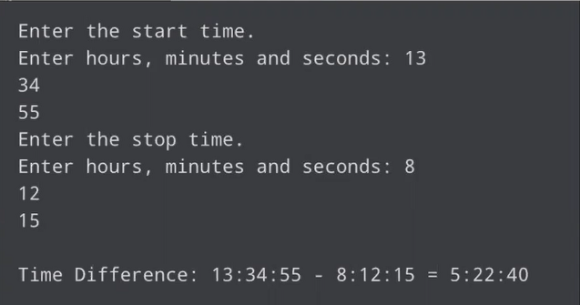
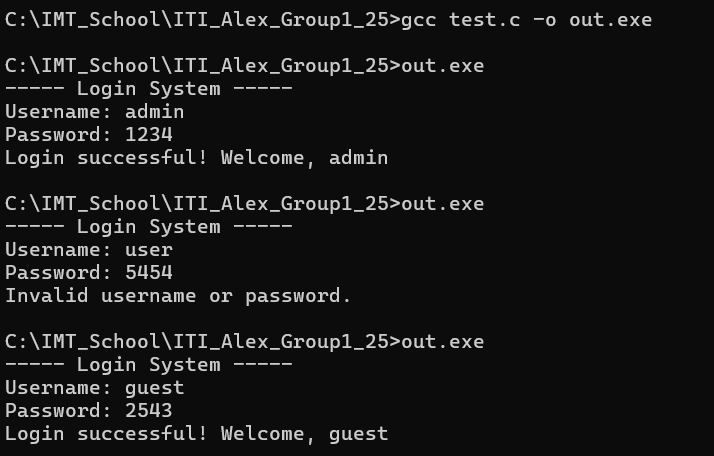

# Session: User Defined data type (Structure)

## Lab 1
### Problem
Write C Program to add two distances in inch-feet system using structure `feet = 12 inch`



### Solution
```c
#include <stdio.h>

struct Distance{
	int feet;
	float inch;
};

int main() {
	struct Distance distance_1, distance_2, distance_sum;
	printf("Enter 1st distance\n");
	printf("Enter feet: ");
	scanf("%d",&distance_1.feet);
	printf("Enter inch: ");
	scanf("%f",&distance_1.inch);
	
	printf("Enter 2nd distance\n");
	printf("Enter feet: ");
	scanf("%d",&distance_2.feet);
	printf("Enter inch: ");
	scanf("%f",&distance_2.inch);
	
	distance_sum.feet = distance_1.feet + distance_2.feet;
	float inch_sum = distance_1.inch + distance_2.inch;
	
	if(inch_sum >= 12 )
	{
		/* can't use mod (%) here because it works only for integers, and casting early loses decimal precision.*/
		/*remaining inch  =  inch     -  full feet portion*/
		distance_sum.inch =  inch_sum - (((int)inch_sum / 12) * 12);
		distance_sum.feet= distance_sum.feet + (inch_sum /12);
	
	}else 
	{
		distance_sum.inch = inch_sum;

	}
	printf("\nSum of distances = %d\'-%.1f\"",distance_sum.feet, distance_sum.inch);
	
    return 0;
}

```
## Lab 2
### Problem
Write c program to Calculate Difference Between Two Time Periods (by using structure, typedef and functions)



### Solution
```c

##include <stdio.h>

typedef struct Time{
	int hours;
	int mins;
	int seconds;
} Time_t;

Time_t getTimeDiff(Time_t start, Time_t stop);

int main() {
	Time_t t1, t2, res;
	printf("Enter the start time.\n");
	printf("Enter hours, mins and seconds: ");
	scanf("%d",&t1.hours);
	scanf("%d",&t1.mins);
	scanf("%d",&t1.seconds);
	printf("\n");
	printf("Enter the stop time.\n");
	printf("Enter hours, mins and seconds: ");
	scanf("%d",&t2.hours);
	scanf("%d",&t2.mins);
	scanf("%d",&t2.seconds);

	res = getTimeDiff(t1, t2);
	
	printf("\nTIME DIFFERENCE: %d:%d:%d - %d:%d:%d = ", t1.hours, t1.mins, t1.seconds, t2.hours, t2.mins, t2.seconds);
    printf("%d:%d:%d", res.hours, res.mins, res.seconds );
	return 0;
}

Time_t getTimeDiff(Time_t start, Time_t stop)
{
	Time_t res;
	// Borrowing seconds in case start second is greater than stop second
	if(start.seconds > stop.seconds)
	{
		stop.seconds+=60;
		stop.mins--;
	}
	res.seconds = stop.seconds - start.seconds;

	// Borrowing mins in case start min is greater than stop min
	if(start.mins > stop.mins)
	{
		stop.mins+=60;
		stop.hours--;
	}
	
	res.mins = stop.mins - start.mins;
	res.hours = stop.hours - start.hours ;
	
	
	return res;
}
```
## Lab 3
### Problem
Modify previous lab and use `pointer to struct`
### Solution
```c
#include <stdio.h>

typedef struct Time{
	int hours;
	int mins;
	int seconds;
} Time_t;

void getTimeDiff(Time_t start, Time_t stop, Time_t* res);

int main() {
	Time_t t1, t2, res;
	printf("Enter the start time.\n");
	printf("Enter hours, mins and seconds: ");
	scanf("%d",&t1.hours);
	scanf("%d",&t1.mins);
	scanf("%d",&t1.seconds);
	printf("\n");
	printf("Enter the stop time.\n");
	printf("Enter hours, mins and seconds: ");
	scanf("%d",&t2.hours);
	scanf("%d",&t2.mins);
	scanf("%d",&t2.seconds);

	getTimeDiff(t1, t2, &res);
	
	printf("\nTIME DIFFERENCE: %d:%d:%d - %d:%d:%d = ", t1.hours, t1.mins, t1.seconds, t2.hours, t2.mins, t2.seconds);
    printf("%d:%d:%d", res.hours, res.mins, res.seconds );
	return 0;
}

void getTimeDiff(Time_t start, Time_t stop, Time_t* res)
{
	
	// Borrowing seconds in case start second is greater than stop second
	if(start.seconds > stop.seconds)
	{
		stop.seconds+=60;
		stop.mins--;
	}
	res->seconds = stop.seconds - start.seconds;

	// Borrowing mins in case start min is greater than stop min
	if(start.mins > stop.mins)
	{
		stop.mins+=60;
		stop.hours--;
	}
	
	res->mins = stop.mins - start.mins;
	res->hours = stop.hours - start.hours ;

}

```
## Lab 4
### Problem
Create a login system using an array of structs and typedef to store predefined usernames and passwords and display appropriate messages for successful or failed login attempts.



### Solution
```c
#include <stdio.h>
#include <string.h>

typedef struct User{
    char uname[50];
    char password[20];

}user_t;

int main(int argc, char** argv)
{
    user_t users[]={
        {"admin","1234"},       // 1st user
        {"guest", "2543"},      // 2nd user
        {"host","127.0.0.1"}    // 3rd user
    };

    int nUsers = sizeof(users)/sizeof(users[0]); 

    char username [50];
    char password [50];
    char found = 0;

    printf("----- Login System -----\n");
    printf("Username: ");
    scanf("%s", username);

    printf("Password: ");
    scanf("%s", password);

    for(int i=0; i<nUsers; i++)
    {
        if(!strcmp(username, users[i].uname))
            if(!strcmp(password, users[i].password)){
                found = 1;
                printf("Login successful! Welcome, %s\n", username);
                break;
            }
    }
    
    if(!found)
        printf("Invalid username or password.\n");

    return 0;
}

```

