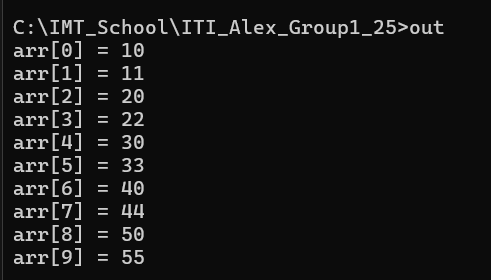

# Session: Preprocessor - Dynamic Memory Allocation - Linked list


## Lab 1 : Function-like-macro
### Problem
Write a C program that calculates and prints the square of a user-input integer using a macro.


### Solution

```c

#include <stdio.h>

#define SQUARE(x) ((x)*(x))

int main() {
	int num ;
	printf("Enter number to find the square: ");
	scanf("%d", &num);
	printf("%d",SQUARE(num));
	return 0;
}

```
## Lab 2 : Function-like-macro
### Problem

What would be the output of this code <br>
` gcc -E file.c -o out.i`
```c
#include <stdio.h>

#define FUNC(x, y) ( (x)+(y) * (x)+(y) )

int main() {
	int num1, num2 ;
	printf("Enter 2 numbers: ");
	scanf("%d %d", &num1, &num2);
	printf("%d",FUNC(num1,num2));
	return 0;
}


```
## Lab 3 : Function-like-macro

Write a c code to to set a bit in a 1 byte memory <br>
implement your math.h file
- `set bit`
- `clr bit`
- `tog bit`
- `get bit`
- `set byte`


### Solution
```c
#include <stdio.h>

#define SET_BIT(reg, nbit)  (reg |= (1<<nbit))
#define CLR_BIT(reg, nbit)	(reg &= ~(1<<nbit))
#define TOG_BIT(reg, nbit)  (reg ^= (1<<nbit))
#define GET_BIT(reg, nbit)  ((reg >> nbit)& 1)
#define SET_BYTE(reg,value)  (reg = value)

int main() {
	int reg, bit, num ;
	
	printf("Num: ");
	scanf("%d", &reg);
	num = reg;
	printf("Bit number: ");
	scanf("%d", &bit);
	printf("After Set bit number %d  of %d. Result =  %d", bit, num, SET_BIT(reg, bit));
	return 0;
}

```

## Lab 1: Dynamic Memory allocation
### Problem
Write a C program merges two integer arrays, sorts the combined elements in ascending order, and displays the sorted result.


### Solution
```c
#include <stdio.h>
#include <stdlib.h>

int* Sort(int *arr1,int size1, int *arr2, int size2);

int main(int argc, char **argv)
{
	
	int arr1[] = {10, 20, 30, 40, 50};
	int arr2[] = {33, 22, 44, 11, 55};
	int size1 = sizeof(arr1)/ sizeof(arr1[0]);
	int size2 = sizeof(arr2)/ sizeof(arr2[0]);
	
	int *sortedArr = Sort(arr1, size1, arr2, size2);
	if(NULL != sortedArr)
	{
	 	for (int i = 0; i < size1+size2; i++)
	 	{
	 		printf("arr[%d] = %d\n",i,sortedArr[i]);
	 	}
	 	free(sortedArr);
	}
	

	return 0;
}


int* Sort(int *arr1,int size1, int *arr2, int size2)
{
	int *newArr = (int *)malloc((size1+size2)* sizeof(int));
	if(NULL == newArr)
	{
		printf("Can't Allocate Memory\n");
		return NULL;
	}
	for(int i=0;i<size1;i++)
		newArr[i] = arr1[i];
	
	for(int i=0;i<size2;i++)
		newArr[size1+i] = arr2[i];
	
	int temp = 0;
	
	// Algorithm - > bubble sort
	for(int i =0; i<(size1+size2)-1;i++)
	{
		for (int j = 0; j < (size1+size2)-1-i; j++)
		{
			if(newArr[j]>newArr[j+1])
			{
				temp = newArr[j];
				newArr[j] = newArr[j+1];
				newArr[j+1] = temp;
			}
		}
		
	}
	
	return newArr;
}

```


## Lab : Single Linked list implementation


```c
#include <stdio.h>
#include <stdlib.h>

/*
Operations:
- insert from start
- insert from end
- print
*/

typedef struct Node_t{
	int data;
	struct Node_t* next;
}node;

node* head = NULL;

void addFirst(int value)
{
	/* allocate memory and save address its address in ptr*/
	node *ptr = (node*)malloc(2*sizeof(node));
	/* allocation failed "no storage inside heap" */
	if(ptr == NULL)
	{
		printf("Can't allocate memory");
	}
	/* struct allocated successfully */
	else{
		ptr->data = value;
		if(head == NULL)
		{
			ptr->next = NULL;    /* if this is the first node in the list */
		}else{
			ptr->next = head;    /* if there were exixting nodes in the list */
		}
		head = ptr;
	}
	  
}

void displaylist()
{
	/* check if list is empty or not */
	if(head != NULL )
	{
		node* temp = head; 	  // start
		while(temp != NULL)   // condition to print
		{
			printf("%d ", temp->data);
			temp = temp->next;
		}
	}else
	{
		printf("Empty list\n");
	}
	
}

void addLast(int data)
{
	node* newNode= (node*)malloc(sizeof(node));
	 if(NULL != newNode)
	 {
		newNode -> data = data;
		newNode -> next = NULL;
		
		if(head != NULL)
		{
			/*Traverse the list*/
			node* temp = head; 
			while(temp->next != NULL) 
			{
				temp = temp->next;
			}
			temp -> next = newNode; 
			
		}else{
			head = newNode;
		}
		
		
	 }else
	 {
		 printf("Can't allocate memory\n");
	 }
}
int main() {
	
	addFirst(4);
	addFirst(44);
	addFirst(40);
	addLast(1);
	addLast(9);
	displaylist();

	return 0;
}

```
