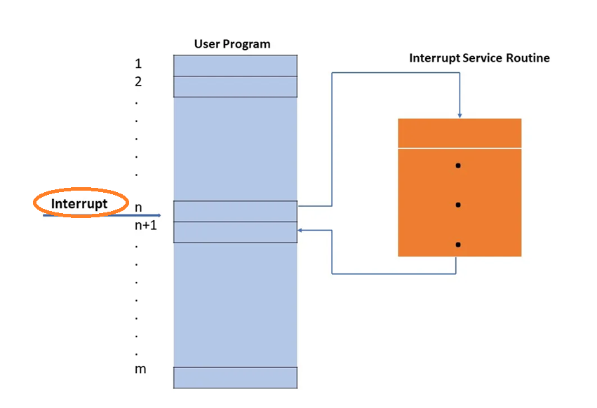
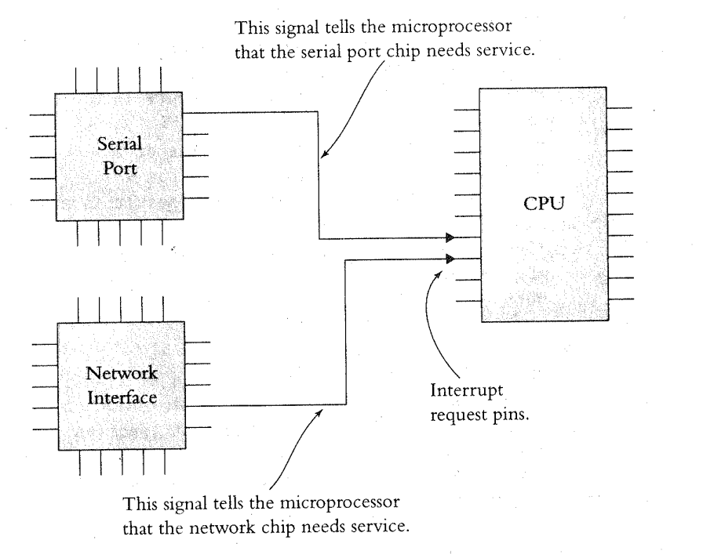
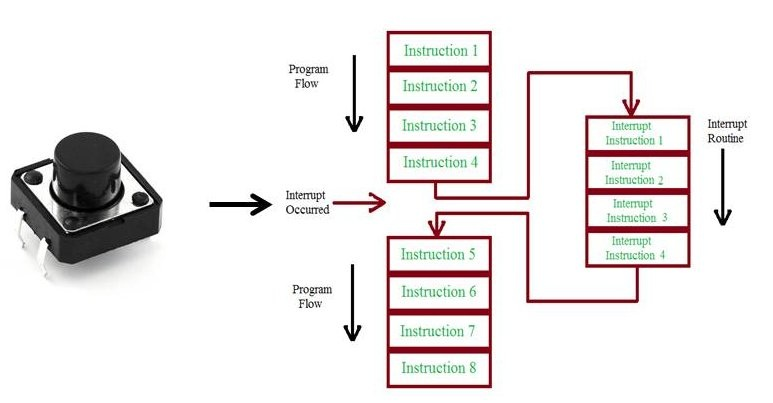
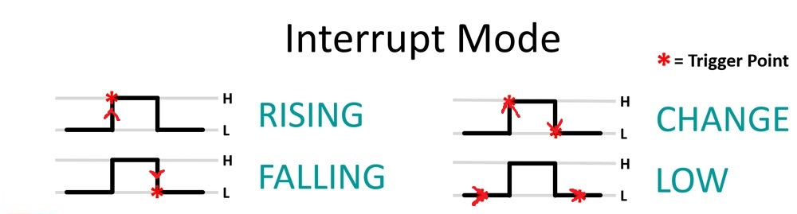
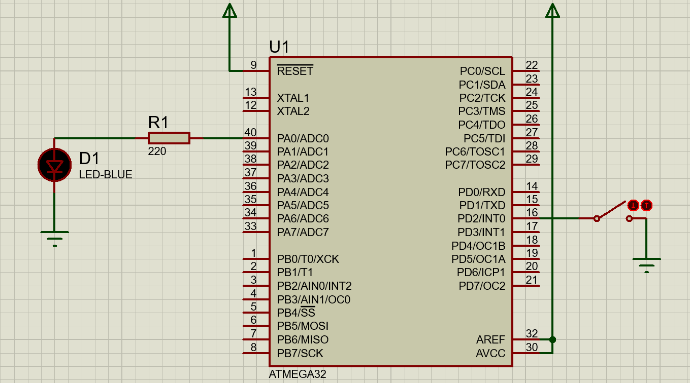

# Session: EXTI
## Objectives
* Into to Interrupts
* EXTI
* Hands-on Labs


##  Into to Interrupts
### Real Life Example
Imagine you're studying `(your main task)`, and suddenly, your phone rings `(the interrupt)`. You pause your writing, answer the call, then return to your study once the call is over.

### Microprocessor Example
The microprocessor can be `interrupted`, that is told to stop doing what it is doing and execute some other piece of software, the interrupt routine. The signal that tells the microprocessor that it is time to run the interrupt routine is the interrupt request or `ISR`.

<br>



<br>

### Interrupt Basics
Interrupts start with a signal from the hardware. Most I/O chips, such as ones that drive serial ports `ex: UART modules` or network interfaces `ex: Wi-Fi module`, need attention when certain events occur.
<br>
For example, when a UART peripheral receives a character via its receive line, it needs the microprocessor to read that character from where it is stored inside the UART and move it to memory. Similarly, when the UART finishes transmitting one character, it needs the microprocessor to send it the next character to be transmitted. A network chip — and almost any other kind of I/O chip — needs the microprocessor’s assistance for similar sorts of events.

<br>
Each of these chips has a pin that it asserts when it requires service. The hardware engineer attaches this pin to an input pin on the microprocessor called an interrupt request (IRQ). This tells the microprocessor that another chip in the circuit needs attention.

<br>
Microprocessors typically have several such interrupt request pins, allowing multiple external devices to request service independently. These interrupt signals can come from external hardware, like sensors , buttons or communication modules, which the designer can freely connect to the available IRQ pins.

<br>
In addition, some interrupts come from internal peripherals, such as UART modules, timers, or ADC converters. These are connected internally within the microcontroller or processor, without using physical pins. Both internal and external sources can trigger interrupts, enabling flexible and responsive system behavior.

<br>



<br>

### Summary
`Source of Interrupt:` Interrupts can come from external devices (e.g., sensors, buttons) via IRQ (INT) pins, or from internal peripherals (e.g., timers, ADC, internal UART) within the microcontroller
<br>

`What Microprocessors Do When an Interrupt Happens:`
1. Pause the main program
2. Jump to the Interrupt Service Routine (ISR) — a special function to handle the event
3. Execute the ISR (e.g., read data, clear a flag).
4. Return to the paused main program and continue execution.

`What ISR (Interrupt Service Routine) do` 
An ISR is a function that is automatically triggered by a hardware event, such as a timer overflow, UART receive, or external pin change. When the event occurs, the microprocessor pauses its main program and runs your desired function — the ISR — to quickly respond to that event. The ISR typically handles the event, clears the interrupt flag, and then returns control back to the main program.
<br>


## EXTI
EXTI stands for External Interrupt, which is a hardware feature that allows the microcontroller to immediately respond to an event triggered by an external signal such as ( sensors or buttons) on specific pins
<br>



### Interrupt Pins
ATmega32 has three external hardware interrupts on pins `PD2`, `PD3`, and `PB2` which are referred to as `INT0`, `INT1`, and `INT2` respectively. Upon activation of these interrupts, the ATmega controller gets interrupted in whatever task it is doing and jumps to perform the interrupt service routine.

### Types of Signals That Can Trigger INT Pins in ATmega32
The external interrupt (INT) pins on the ATmega32 can be triggered by the following types of signals, depending on the specific interrupt pin and its configuration:

`Low level` Interrupt triggers as long as the pin is held LOW (level sensitive)<br>
`Any logical change` Interrupt triggers on any change (rising or falling edge)<br>
`Falling edge` Interrupt triggers only on a HIGH to LOW transition <br>
`Rising edge` 	Interrupt triggers only on a LOW to HIGH transition <br>




## Lab 1: Interfacing with INT0 without Callback mechanism



<br>

```c
/*
 * main.c
 *
 *  Created on: Jul 22, 2025
 *      Author: Nada Mamdouh
 */
#define F_CPU 	8000000UL
#include "../LIB/STD_TYPES.h"
#include "../MCAL/DIO/DIO_int.h"
#include "../MCAL/EXTI/EXTI_int.h"
#include <util/delay.h>

#include <avr/io.h>
#include <avr/interrupt.h>

// hw interrupt isr
ISR(INT0_vect)
{
	// my function
	MDIO_vTogPinVal(DIO_PORTA, DIO_PIN0);
}


int main()
{
	// interrupt pin
	MDIO_vSetPinDir(DIO_PORTD, DIO_PIN2, DIO_INPUT);
	// activate pull up resistor
	MDIO_vSetPinVal(DIO_PORTD, DIO_PIN2, DIO_HIGH);

	// led pin
	MDIO_vSetPinDir(DIO_PORTA, DIO_PIN0, DIO_OUTPUT);
	MEXTI_vInit();
	MGIE_vEnableGlobalInterrupt();

	while(1)
	{

	}

	return 0;
}

```

## Lab 2: Using Callback mechanism
```c
/*
 * main.c
 *
 *  Created on: Jul 22, 2025
 *      Author: Nada Mamdouh
 */
#define F_CPU 	8000000UL
#include "../LIB/STD_TYPES.h"
#include "../MCAL/DIO/DIO_int.h"
#include "../MCAL/EXTI/EXTI_int.h"
#include "../MCAL/GIE/GIE_int.h"
#include <util/delay.h>

void Toggel_func(void)
{
	MDIO_vTogPinVal(DIO_PORTA, DIO_PIN0);
}

int main()
{
	// configure led as output
	MDIO_vSetPinDir(DIO_PORTA, DIO_PIN0, DIO_OUTPUT);

	// configure switch as input and activate pull up resistor
	MDIO_vSetPinDir(DIO_PORTD, DIO_PIN2, DIO_INPUT);
	MDIO_vSetPinVal(DIO_PORTD, DIO_PIN2, DIO_HIGH);

	MEXTI_vInit();
	MGIE_vEnableGlobalInterrupt();

	// using callback mechanism to pass a function to EXTI_prg.c and 0 means using INT0
	MEXTI_vCallBackFunction(Toggel_func, 0);

	while(1)
	{


	}

	return 0;
}

```
