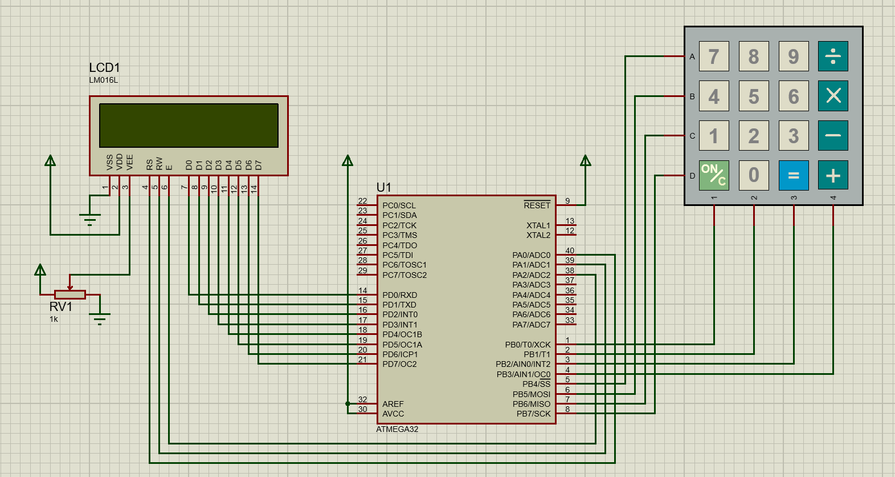
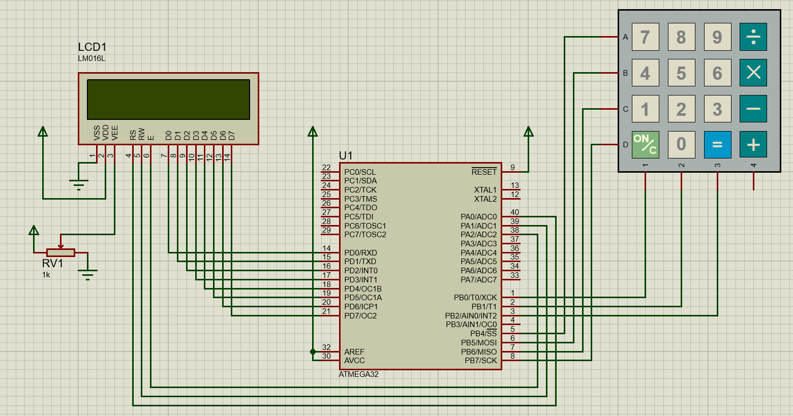

# Session : Keypad

## Lab 1: Interfacing Keypad and LCD without Keypad driver



<br>

```c
/*
 * main.c
 *
 *  Created on: Jul 19, 2025
 *      Author: Nada Mamdouh
 */
#define F_CPU 	8000000UL
#include "../LIB/STD_TYPES.h"
#include "../MCAL/DIO/DIO_int.h"
#include "../HAL/LCD/LCD_int.h"
#include <util/delay.h>

#define ROWS	4
#define COLS	4

u8 KeyMap[ROWS][COLS] = {   	{'1','2','3','A' },
					            {'4','5','6','B' },
				                {'7','8','9','C' },
					            {'*','0','#','D' }
			                                             };

void KPD_vInit(void)
{
	/* First 4 bits are output and the rest are input */
	MDIO_vSetPortDir(DIO_PORTB, 0b00001111);

	/* Activate pull-up resistor for input pins and deactivate all cols (output->high) */
	MDIO_vSetPortVal(DIO_PORTB, 0xFF);
}

int main()
{
	MDIO_vInit();

	KPD_vInit();
	HLCD_vInit();

	u8 L_u8Pressed_key = 0;
	while(1)
	{
		// u write
		for(u8 Col =0; Col<4; Col++)
		{
			/* Activate current column */
			MDIO_vSetPinVal(DIO_PORTB, Col, DIO_LOW);
			// row sense read
			for(u8 Row=0; Row<4; Row++)
			{
				if(MDIO_u8GETPinVal(DIO_PORTB, Row+4) == 0)  // is pressed
				{
					
					while(MDIO_u8GETPinVal(DIO_PORTB, Row+4) == 0){} // is still pressed
						// debouncing
						_delay_ms(10);

						// take action
						L_u8Pressed_key =  KeyMap[Row][Col]; /* Key number */
						HLCD_vSendChar(L_u8Pressed_key);
						
					
				}
			}
			/* Deactivate current column */
			MDIO_vSetPinVal(DIO_PORTB, Col, DIO_HIGH);
		}

	}

	return 0;
}

```
## Lab 2: Testing Driver with (4-Rows, 3-Cols Keypad)



<br>

### Make sure KPD_int.h is configured as following 

```c
#define KPD_ROWS	4
#define KPD_COLS	3

#define COL_INIT    0
#define COL_END     3
#define ROW_INIT    4
#define ROW_END     8
```
```c
/*
 * main.c
 *
 *  Created on: Jul 22, 2025
 *      Author: Nada Mamdouh
 */
#define F_CPU 	8000000UL
#include "../LIB/STD_TYPES.h"
#include "../MCAL/DIO/DIO_int.h"
#include "../HAL/LCD/LCD_int.h"
#include "../HAL/KPD/KPD_int.h"
#include <util/delay.h>


u8 KeyMap[KPD_ROWS][KPD_COLS] =
{
    {'1', '2', '3'},
    {'4', 'M', 'B'},
    {'7', '8', 'C'},
    {'*', '0', 'D'}
};

int main()
{
	u8 pressedKey = 0;
	MDIO_vInit();
	HKPD_vInit();
	HLCD_vInit();

	while(1)
	{
		pressedKey = HKPD_u8GetPressedKey(KeyMap);
		if(pressedKey != NO_KEY)
			HLCD_vSendChar(pressedKey);


	}

	return 0;
}

```
## Lab 3: Testing Driver with (4-Rows, 4-Cols Keypad)


<br>

### Make sure KPD_int.h is configured as following 


```c
#define KPD_ROWS	4
#define KPD_COLS	4

#define COL_INIT    0
#define COL_END     4
#define ROW_INIT    4
#define ROW_END     8
```

```c
/*
 * main.c
 *
 *  Created on: Jul 22, 2025
 *      Author: Nada Mamdouh
 */
#define F_CPU 	8000000UL
#include "../LIB/STD_TYPES.h"
#include "../MCAL/DIO/DIO_int.h"
#include "../HAL/LCD/LCD_int.h"
#include "../HAL/KPD/KPD_int.h"
#include <util/delay.h>


u8 KeyMap[KPD_ROWS][KPD_COLS] =
{
	    {'1', '2', '3', 'A'},
	    {'4', '5', '6', 'B'},
	    {'7', '8', '9', 'C'},
	    {'*', '0', '#', 'D'}
};

int main()
{
	u8 pressedKey = 0;
	MDIO_vInit();
	HKPD_vInit();
	HLCD_vInit();

	while(1)
	{
		pressedKey = HKPD_u8GetPressedKey(KeyMap);
		if(pressedKey != NO_KEY)
			HLCD_vSendChar(pressedKey);
	}

	return 0;
}

```