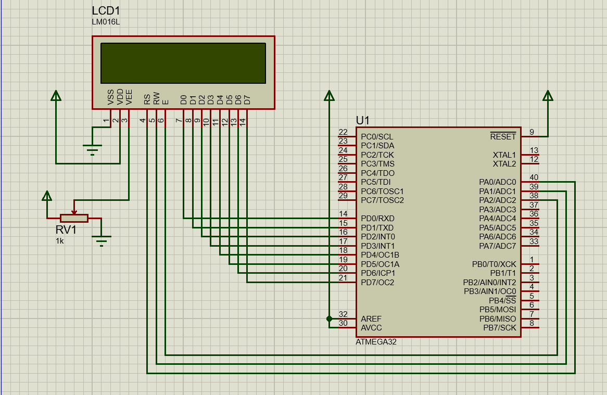

# Session : LCD
## Lab 1 :



<br>

```c
#define F_CPU 	8000000UL
#include "../LIB/STD_TYPES.h"
#include "../MCAL/DIO/DIO_int.h"
#include "../HAL/LCD/LCD_int.h"
#include <util/delay.h>


int main()
{
	HLCD_vInit();
	HLCD_vDisplayString("ITI");
	HLCD_vPrintNumber(12435);
	HLCD_vSetCursorPosition(0,0);
	HLCD_vSendChar('I');
	HLCD_vSetCursorPosition(1,1);
	HLCD_vSendChar('T');
	HLCD_vSetCursorPosition(0,2);
	HLCD_vSendChar('I');
	while(1)
	{


	}

	return 0;
}

```
