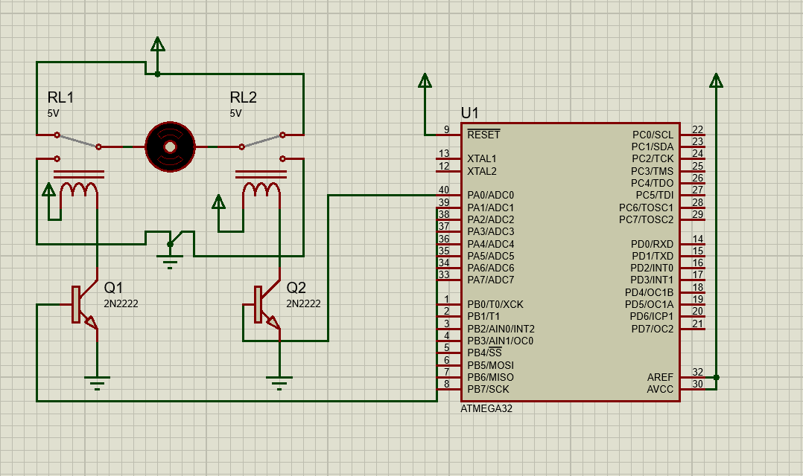
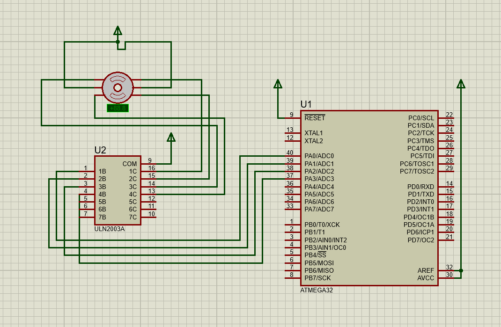

# Motors
## Lab 1: H-bridge using 2-relays 



<br>

```c

/*
 * main.c
 *
 *  Created on: Jul 22, 2025
 *      Author: Nada Mamdouh
 */
#define F_CPU 	8000000UL
#include "../LIB/STD_TYPES.h"
#include "../MCAL/DIO/DIO_int.h"
#include "../HAL/LCD/LCD_int.h"
#include "../HAL/KPD/KPD_int.h"
#include <util/delay.h>


int main()
{
	MDIO_vSetPinDir(DIO_PORTA, DIO_PIN0, DIO_OUTPUT);
	MDIO_vSetPinDir(DIO_PORTA, DIO_PIN1, DIO_OUTPUT);

	while(1)
	{

		// cw
		MDIO_vSetPinVal(DIO_PORTA, DIO_PIN0,DIO_HIGH);
		MDIO_vSetPinVal(DIO_PORTA, DIO_PIN1,DIO_LOW);
		_delay_ms(500);
		// ccw
		MDIO_vSetPinVal(DIO_PORTA, DIO_PIN1,DIO_HIGH);
		MDIO_vSetPinVal(DIO_PORTA, DIO_PIN0,DIO_LOW);
		_delay_ms(500);

		// stop
		MDIO_vSetPinVal(DIO_PORTA, DIO_PIN0,DIO_HIGH);
		MDIO_vSetPinVal(DIO_PORTA, DIO_PIN1,DIO_HIGH);
		_delay_ms(500);

	}

	return 0;
}

```
## Lab 2: Stepper Motor Control using ULN2003



<br>

```c
/*
 * main.c
 *
 *  Created on: Jul 23, 2025
 *      Author: Nada Mamdouh
 */
#define F_CPU 	8000000UL
#include "../LIB/STD_TYPES.h"
#include "../MCAL/DIO/DIO_int.h"
#include "../HAL/STEPPER/STEPPER_int.h"
#include <util/delay.h>


int main()
{
	STEPPER_vInit();

    /* Turn one revolution (for hardware connection)*/
	// for(u16 i = 0;i<16;i++)
	// {
	// 	STEPPER_vRotateCW(10);
	// }

	/* Turn one revolution (for hardware connection)*/
	for(u16 i = 0;i<512;i++)
	{
		STEPPER_vRotateCW(10);
	}


	while(1)
	{

	}

	return 0;
}

```