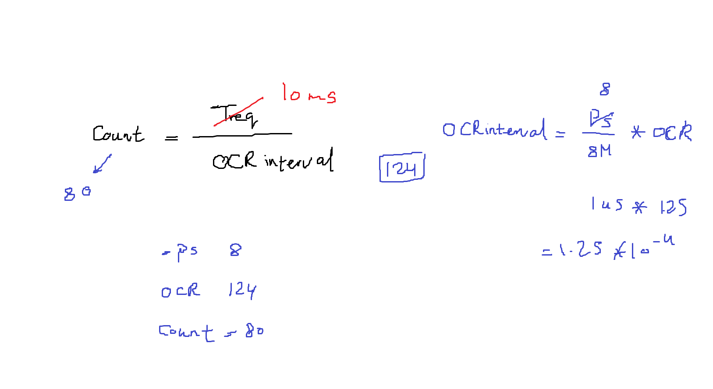

# Session: RTOS

## Lab : blink 3 different LEDs. LED1 each 500ms, LED2 each 1000ms and LED3 each 1500ms
Lets choose a Ticktime of 10ms


### Timer 0 configuration
```c
    /* CTC mode */
    #define TIMERID_0_MODE	CTC

    /* Enable interrupt */
    #define INTERRUPR_CONTROL	ENABLE

    /* Prescaler = 8 */
    #define CLK_SELECT_PRESCALER_TIM0	CLK_8

```

### RTOS configuration
```c
    #define OCR_VAL		124
    #define COUNT		80
```

### main.c
```c
/*
 * main.c
 *
 *  Created on: Aug 6, 2025
 *      Author: Nada Mamdouh
 */
#define F_CPU 	8000000UL
#include "../LIB/STD_TYPES.h"
#include "../MCAL/DIO/DIO_int.h"
#include "../MCAL/GIE/GIE_int.h"
#include "../MCAL/SPI/SPI_int.h"
#include "../MCAL/TWI/TWI_int.h"
#include "../MCAL/ADC/ADC_int.h"
#include "../HAL/LCD/LCD_int.h"
#include "../RTOS/RTOS_int.h"
#include <util/delay.h>


void LED1(void)
{
	MDIO_vTogPinVal(DIO_PORTA, DIO_PIN0);
}
void LED2(void)
{
	MDIO_vTogPinVal(DIO_PORTA, DIO_PIN1);
}
void LED3(void)
{
	MDIO_vTogPinVal(DIO_PORTA, DIO_PIN2);
}


int main()
{
	MGIE_vEnableGlobalInterrupt();

	MDIO_vSetPinDir(DIO_PORTA, DIO_PIN0, DIO_OUTPUT);
	MDIO_vSetPinDir(DIO_PORTA, DIO_PIN1, DIO_OUTPUT);
	MDIO_vSetPinDir(DIO_PORTA, DIO_PIN2, DIO_OUTPUT);

	RTOS_u8CreateTask(LED1, 50, 0, 0);
	RTOS_u8CreateTask(LED2, 100, 1, 0);
	RTOS_u8CreateTask(LED3, 150, 2, 0);


	RTOS_vStartOS();

	while(1)
	{

	}

	return 0;
}

```