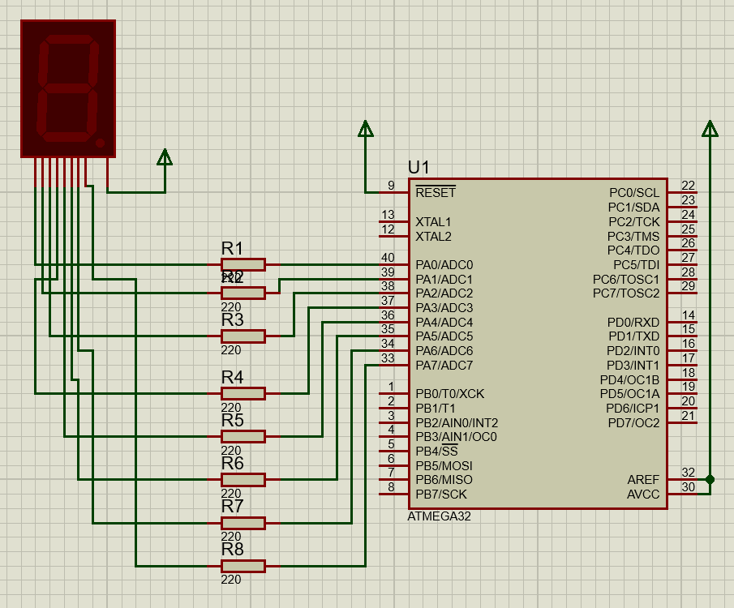
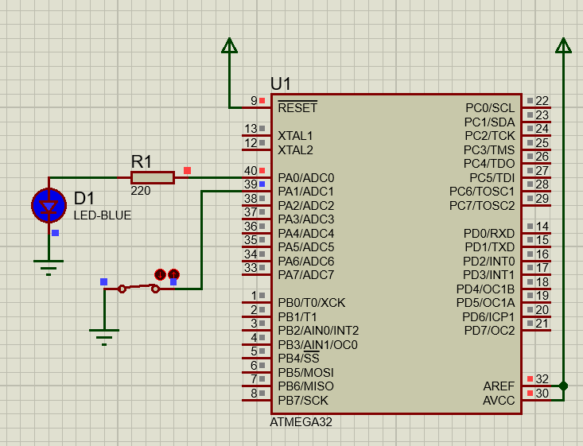

# Session : 7-Segments and DIP switch
## Lab 1: 7-Segmets



<br>

```c
#define F_CPU 	8000000UL
#include "../LIB/STD_TYPES.h"
#include "../MCAL/DIO/DIO_int.h"
#include <util/delay.h>

u8 Sevensegment[] = {
		0b00111111 ,  // 0
		0b00000110 ,  // 1
		0b01011011 ,  // 2
		0b01001111 ,  // 3
		0b01100110 ,  // 4
		0b01101101 ,  // 5
		0b01111101 ,  // 6
		0b00000111 ,  // 7
		0b01111111 ,  // 8
		0b01101111 ,  // 9

};

int main()
{
	MDIO_vSetPortDir(DIO_PORTA, 0xFF);
	u8 size = sizeof(Sevensegment)/sizeof(Sevensegment[0]);

	while(1)
	{


		for(u8 i=0; i<size; i++)
		{
			MDIO_vSetPortVal(DIO_PORTA,~Sevensegment[i]);
			_delay_ms(500);
		}
		for(u8 i=size; i>0; i--)
		{
			MDIO_vSetPortVal(DIO_PORTA,~Sevensegment[i-1]);
			_delay_ms(500);
		}
	}
	return 0 ;
}

```
## Lab 2: Display a number on 7-segments using SSD driver
```c
/*
 * main.c
 *
 *  Created on: Jul 20, 2025
 *      Author: Nada Mamdouh
 */
#define F_CPU 	8000000UL
#include "../LIB/STD_TYPES.h"
#include "../MCAL/DIO/DIO_int.h"
#include "../HAL/SSD/SSD_int.h"
#include <util/delay.h>


int main()
{
	MDIO_vInit();
	HSSD_vInit();
	HSSD_vDisplayNumber(7);


	while(1)
	{

	}


	return 0;
}

```

## Lab 3: When DIP switch is clicked turn LED on otherwise turn it off



<br>

```c
/*
 * main.c
 *
 *  Created on: Jul 20, 2025
 *      Author: Nada Mamdouh
 */
#define F_CPU 	8000000UL
#include "../LIB/STD_TYPES.h"
#include "../MCAL/DIO/DIO_int.h"
#include <util/delay.h>

int main()
{
	MDIO_vInit();
	/* Set pin A0 direction for the LED as output */
	MDIO_vSetPinDir(DIO_PORTA, DIO_PIN0, DIO_OUTPUT);

	/* Set pin A1 direction for the switch as input */
	MDIO_vSetPinDir(DIO_PORTA, DIO_PIN1, DIO_INPUT);

	/* Activate internal pull up for pin A1 */
	MDIO_vSetPinVal(DIO_PORTA, DIO_PIN1, DIO_HIGH);

	while(1)
	{
		/* Read pin value to check whether switch is clicked or not */
		if(MDIO_u8GETPinVal(DIO_PORTA, DIO_PIN1) == 0)
		{
			MDIO_vSetPinVal(DIO_PORTA, DIO_PIN0, DIO_HIGH);
		}else
		{
			MDIO_vSetPinVal(DIO_PORTA, DIO_PIN0, DIO_LOW);
		}

	}

	return 0;
}

```
