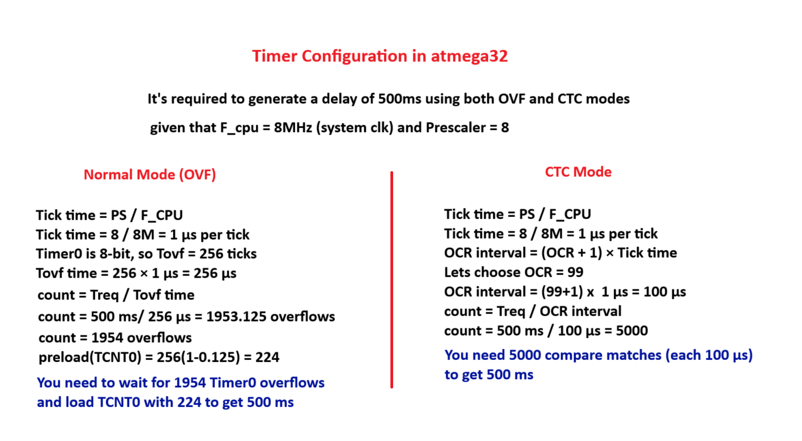
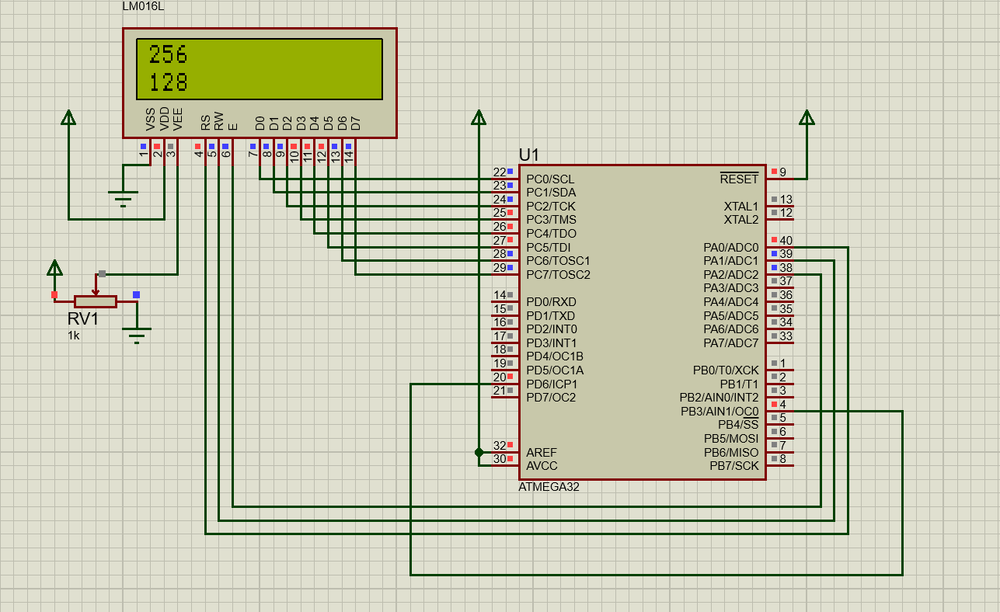

# Session: Timers
## Timer Calculation

<br>

## Lab 1: Overflow mode with estimate value
```c
/*
 * main.c
 *
 *  Created on: Jul 27, 2025
 *      Author: Nada Mamdouh
 */
#define F_CPU 	8000000UL
#include "../LIB/STD_TYPES.h"
#include "../MCAL/DIO/DIO_int.h"
#include "../MCAL/ADC/ADC_int.h"
#include "../HAL/LCD/LCD_int.h"
#include "../MCAL/GIE/GIE_int.h"
#include "../MCAL/TIMERS/TIMERS_int.h"
#include <util/delay.h>

void Toggle(void)
{
	MDIO_vTogPinVal(DIO_PORTA, DIO_PIN0);
}

int main()
{
	MDIO_vSetPinDir(DIO_PORTA, DIO_PIN0, DIO_OUTPUT);
	MTIMERS_vInit();
	MGIE_vEnableGlobalInterrupt();
	// toggle each 500ms
	MTIMERS_vSetIntervalAsych_CB(Toggle,2000);


	while(1)
	{


	}


	return 0;
}

```
## Lab 1: Overflow mode with absolute value
```c
/*
 * main.c
 *
 *  Created on: Jul 27, 2025
 *      Author: Nada Mamdouh
 */
#define F_CPU 	8000000UL
#include "../LIB/STD_TYPES.h"
#include "../MCAL/DIO/DIO_int.h"
#include "../MCAL/ADC/ADC_int.h"
#include "../HAL/LCD/LCD_int.h"
#include "../MCAL/GIE/GIE_int.h"
#include "../MCAL/TIMERS/TIMERS_int.h"
#include <util/delay.h>

void Toggle(void)
{
	MDIO_vTogPinVal(DIO_PORTA, DIO_PIN0);
}

int main()
{
	MDIO_vSetPinDir(DIO_PORTA, DIO_PIN0, DIO_OUTPUT);
	MTIMERS_vInit();
	MGIE_vEnableGlobalInterrupt();
	// toggle each 500ms
	MTIMER_vSetPreloadValue(TIMERID_0, 224);
	MTIMERS_vSetIntervalAsych_CB(Toggle,1954);


	while(1)
	{


	}


	return 0;
}

```

## Lab 2: CTC mode
```c
/*
 * main.c
 *
 *  Created on: Jul 27, 2025
 *      Author: Nada Mamdouh
 */
#define F_CPU 	8000000UL
#include "../LIB/STD_TYPES.h"
#include "../MCAL/DIO/DIO_int.h"
#include "../MCAL/ADC/ADC_int.h"
#include "../HAL/LCD/LCD_int.h"
#include "../MCAL/GIE/GIE_int.h"
#include "../MCAL/TIMERS/TIMERS_int.h"
#include <util/delay.h>

void Toggle(void)
{
	MDIO_vTogPinVal(DIO_PORTA, DIO_PIN0);
}

int main()
{
	MDIO_vSetPinDir(DIO_PORTA, DIO_PIN0, DIO_OUTPUT);
	MTIMERS_vInit();
	MGIE_vEnableGlobalInterrupt();
	// toggle each 500ms
	MTIMERS_vSetInterval_CTC_Asynch(2000, 250,Toggle);


	while(1)
	{


	}


	return 0;
}

```
## Lab 3: PWM fading LED in and out

```c
/*
 * main.c
 *
 *  Created on: Jul 27, 2025
 *      Author: Nada Mamdouh
 */
#define F_CPU 	8000000UL
#include "../LIB/STD_TYPES.h"
#include "../MCAL/DIO/DIO_int.h"
#include "../MCAL/ADC/ADC_int.h"
#include "../HAL/LCD/LCD_int.h"
#include "../MCAL/GIE/GIE_int.h"
#include "../MCAL/TIMERS/TIMERS_int.h"
#include <util/delay.h>


int main()
{
	MDIO_vSetPinDir(DIO_PORTB, DIO_PIN3, DIO_OUTPUT);
	MTIMERS_vInit();
	MTIMERS_vStartTimer();


	while(1)
	{
		//fade in
		for(u8 i=0;i<255;i++)
		{
			MTIMERS_vSetCompareValue(i);
			_delay_ms(20);
		}
		//fade out
		for(u8 i=255; i>0;i--)
		{
			MTIMERS_vSetCompareValue(i-1);
			_delay_ms(20);
		}

	}


	return 0;
}

```
## Lab 4: ICU generating signal on PB3 and capturing it on PD6



<br>

### Timer 0 Configuration
```c
// Fast PWM mode | non-inverting | clk_8
	TCCR0 = 0b01101010;
```

### Timer 1 Configuration
```c
// ICU Rising edge |  clk_8
TCCR1A = 0b00000000;
TCCR1B = 0b01000010;
```

```c
/*
 * main.c
 *
 *  Created on: Jul 28, 2025
 *      Author: Nada Mamdouh
 */
#define F_CPU 	8000000UL
#include "../LIB/STD_TYPES.h"
#include "../MCAL/DIO/DIO_int.h"
#include "../MCAL/GIE/GIE_int.h"
#include "../MCAL/TIMERS/TIMERS_int.h"
#include "../HAL/LCD/LCD_int.h"
#include <util/delay.h>

volatile u8 flag = 0;
volatile u16 T_on = 0;
volatile u16 T_Period = 0;

void Read_PWM(void)
{
	static u16 T_reading[3]={0};
	static u8 counter = 0;
	counter++;
	switch(counter)
	{
	case 1:
		T_reading[0] = MTIMERS_u16GetCapturedValue();
		MTIMERS_SetTrigger(TRIG_TYPE_RISING);
		break;
	case 2:
		T_reading[1] = MTIMERS_u16GetCapturedValue();
		T_Period = T_reading[1] - T_reading[0];
		MTIMERS_SetTrigger(TRIG_TYPE_FALLING);
		break;
	case 3:
		T_reading[2] = MTIMERS_u16GetCapturedValue();
		T_on = T_reading[2] - T_reading[1];
		MTIMERS_SetTrigger(TRIG_TYPE_RISING);
		counter = 0;
		flag = 1;
		MTIMERS_vDisableInterrupt(TIM_1, ICU_MODE);
		break;
	}

}


int main()
{
	MDIO_vSetPinDir(DIO_PORTD, DIO_PIN6, DIO_INPUT);
	MDIO_vSetPinDir(DIO_PORTB, DIO_PIN3, DIO_OUTPUT);
	HLCD_vInit();
	MTIMERS_vInit();
	MGIE_vEnableGlobalInterrupt();
	MTIMERS_vEnableInterrupt(TIM_1, ICU_MODE);

	MTIMERS_vSetCompareMatch(TIM_0 ,127);
	MTIMERS_vSetICU_CB(Read_PWM);


	while(1)
	{
		if(flag == 1)
		{
			HLCD_vClearScreen();
			HLCD_vSetCursorPosition(0,0);
			HLCD_vPrintNumber(T_Period);
			HLCD_vSetCursorPosition(1,0);
			HLCD_vPrintNumber(T_on);
			_delay_ms(500);
			MTIMERS_vEnableInterrupt(TIM_1, ICU_MODE);
			flag = 0;
		}

	}

	return 0;
}

```
