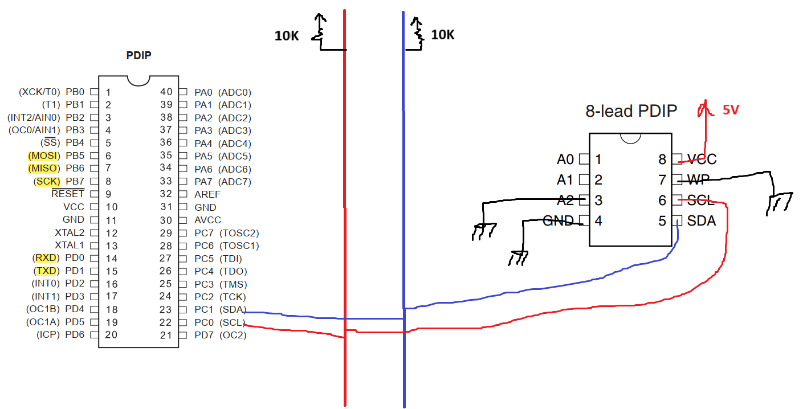

# Session: TWI and EEPROM



## Lab 1:
```c
/*
 * main.c
 *
 *  Created on: Aug 4, 2025
 *      Author: Nada Mamdouh
 */
#define F_CPU 	8000000UL
#include "../LIB/STD_TYPES.h"
#include "../MCAL/DIO/DIO_int.h"
#include "../MCAL/GIE/GIE_int.h"
#include "../MCAL/SPI/SPI_int.h"
#include "../MCAL/TWI/TWI_int.h"
#include <util/delay.h>

void HEEPROM_vWriteByte(u8 A_u8Byte, u8 A_u8SlaAdd, u16 A_u16WordAdd)
{
	MTWI_u8SendStartCondition();
	MTWI_u8SendSLA_RW(A_u8SlaAdd, TWI_WRITE);
	MTWI_u8SendByte((u8)A_u16WordAdd);
	MTWI_u8SendByte(A_u8Byte);
	MTWI_u8SentStopCondition();
}
u8 HEEPORM_u8ReadByte(u8 A_u8SlaAdd, u16 A_u16WordAdd)
{
	u8 L_u8Data;
	MTWI_u8SendStartCondition();
	MTWI_u8SendSLA_RW(A_u8SlaAdd, TWI_WRITE);
	MTWI_u8SendByte((u8)A_u16WordAdd);
	MTWI_u8ResendStartCondition();
	MTWI_u8SendSLA_RW(A_u8SlaAdd, TWI_READ);
	MTWI_u8ReceiveByte(&L_u8Data, TWI_NOT_ACK);
	MTWI_u8SentStopCondition();
	return L_u8Data;

}

int main()
{
	MDIO_vSetPinDir(DIO_PORTA, DIO_PIN0, DIO_OUTPUT);
	MTWI_vInit();

	u8 ch = 0;
	HEEPROM_vWriteByte('T', 0b1010000, 5);
	_delay_ms(10);
	ch = HEEPORM_u8ReadByte(0b1010000,5);

	if(ch == 'T')
	{
		MDIO_vSetPinVal(DIO_PORTA, DIO_PIN0, DIO_HIGH);
	}
	else
	{
		MDIO_vSetPinVal(DIO_PORTA, DIO_PIN0, DIO_LOW);
	}
	while(1)
	{

	}

	return 0;
}


```