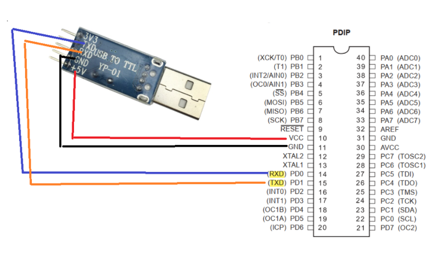
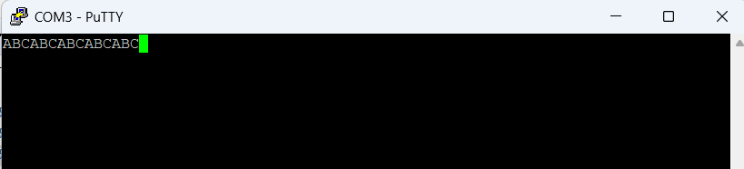

# Session: UART
## Lab1: Test Transmiter



<br>

```c
/*
 * main.c
 *
 *  Created on: Jul 30, 2025
 *      Author: Nada Mamdouh
 */
#define F_CPU 	8000000UL
#include "../LIB/STD_TYPES.h"
#include "../MCAL/DIO/DIO_int.h"
#include "../MCAL/GIE/GIE_int.h"
#include "../MCAL/TIMERS/TIMERS_int.h"
#include "../HAL/LCD/LCD_int.h"
#include "../MCAL/WDT/WDT_int.h"
#include "../MCAL/USART/USART_int.h"
#include <util/delay.h>

int main()
{

	MUSART_vInit();


	while(1)
	{
		MUSART_vTransmit('A');
		_delay_ms(500);
		MUSART_vTransmit('B');
		_delay_ms(500);
		MUSART_vTransmit('C');
		_delay_ms(500);


	}

	return 0;
}

```
## OUTPUT:



## Lab2: Test Receiver (Turn LED on when receiving 'N' and turn it off when receiving 'F')
```c
/*
 * main.c
 *
 *  Created on: Jul 30, 2025
 *      Author: Nada Mamdouh
 */
#define F_CPU 	8000000UL
#include "../LIB/STD_TYPES.h"
#include "../MCAL/DIO/DIO_int.h"
#include "../MCAL/GIE/GIE_int.h"
#include "../MCAL/TIMERS/TIMERS_int.h"
#include "../HAL/LCD/LCD_int.h"
#include "../MCAL/WDT/WDT_int.h"
#include "../MCAL/USART/USART_int.h"
#include <util/delay.h>

int main()
{
	MDIO_vSetPinDir(DIO_PORTA, DIO_PIN0, DIO_OUTPUT);
	u8 saveData = 0;
	MUSART_vInit();


	while(1)
	{

		saveData = MUSART_vReceive();
		if(saveData == 'N')
		{
			MDIO_vSetPinVal(DIO_PORTA, DIO_PIN0, DIO_HIGH);

		}
		else if(saveData == 'F')
		{
			MDIO_vSetPinVal(DIO_PORTA, DIO_PIN0, DIO_LOW);

		}
		saveData = 0;


	}

	return 0;
}

```
